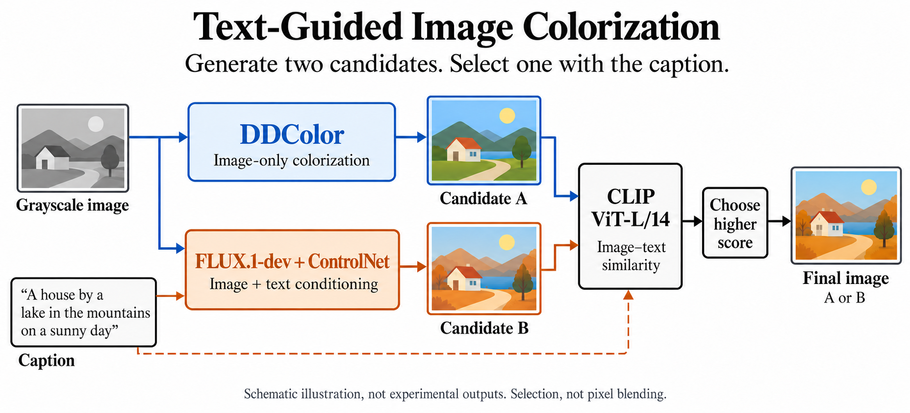

# Text-Guided Image Colorization

흑백 이미지에 **설명문과 어울리는 색을 입히는** 프로젝트입니다. DDColor와 FLUX가 만든 두 컬러 후보를 비교하고, CLIP으로 설명문에 더 가까운 결과를 선택합니다.

**2025 인하 인공지능 챌린지 학부생 부문 우수상, BK21 교육연구단장상**

[추론 코드](APXGPu/run_inference.py) | [실행 가이드](docs/running.md) | [상장](https://gxonu.github.io/assets/colorization-certificate.pdf)

[](docs/pipeline-overview.png)

## 어떤 문제를 풀었나요?

흑백 이미지에는 물체의 모양과 밝기는 남아 있지만 색 정보가 없습니다. 같은 물체도 여러 색으로 복원할 수 있기 때문에, 그럴듯한 색을 입히는 것만으로는 주어진 설명을 만족시키기 어렵습니다.

이 프로젝트의 입력은 **흑백 이미지와 그 장면을 설명하는 텍스트**, 출력은 **설명에 맞게 색을 복원한 이미지**입니다. 이미지의 구조를 유지하면서 텍스트에 등장하는 물체와 색을 반영하는 것이 목표입니다.

## 핵심 아이디어

**서로 다른 방식으로 후보를 만들고, 이미지마다 설명문에 더 가까운 후보를 고릅니다.**

- **DDColor:** 흑백 이미지만 보고 컬러 후보를 만듭니다. 원본의 밝기 정보를 유지하는 색 복원 모델입니다.
- **FLUX.1-dev + ControlNet:** 흑백 이미지를 조건 이미지로, 설명문을 프롬프트로 받아 또 다른 후보를 만듭니다.
- **CLIP:** 두 후보와 설명문을 같은 임베딩 공간에서 비교해, 유사도가 높은 후보 하나를 최종 결과로 선택합니다.

텍스트는 FLUX 생성 단계와 CLIP 선택 단계에 사용됩니다. DDColor에는 입력하지 않습니다. 최종 이미지는 두 후보의 픽셀을 평균한 결과가 아니라 **선택된 후보 이미지 그대로**입니다.

## 추론 파이프라인

1. **컬러 후보 생성** — 각 흑백 이미지에서 DDColor 후보와 FLUX 후보를 각각 생성합니다.
2. **설명문과 비교** — CLIP ViT-L/14로 이미지와 텍스트를 인코딩하고, 정규화된 벡터의 내적으로 유사도를 계산합니다.
3. **이미지별 선택** — 두 유사도 중 높은 쪽을 선택합니다. 동점이면 FLUX를 선택합니다.
4. **결과 저장** — 선택한 이미지, 해당 이미지의 768차원 CLIP 임베딩 CSV, 제출 ZIP을 저장합니다.

```text
선택 결과 = argmax [ CLIP(DDColor 후보, 설명문), CLIP(FLUX 후보, 설명문) ]
```

CLIP 유사도는 후보를 고르는 기준입니다. 실제 색의 정답 여부나 세부 물체의 색까지 보장하는 값은 아닙니다. 모델과 설정의 자세한 대응은 [구현 설명](docs/method.md)에 정리했습니다.

## 성과와 프로젝트 정보

| 항목 | 내용 |
|---|---|
| 대회 | 2025 인하 인공지능 챌린지, Text-Guided Colorization |
| 수상 | 학부생 부문 우수상, BK21 교육연구단장상 |
| 기간 | 2025.06–2025.08 |
| 팀 | APXGPu |
| 역할 | 팀 리더로 모델 구성, 실험 비교, 후보 선택과 최종 제출 전반 주도 |

## 실행

진입점은 [`APXGPu/run_inference.py`](APXGPu/run_inference.py)입니다. DDColor 소스와 사전학습 모델을 준비한 뒤 `APXGPu/`를 작업 디렉터리로 실행합니다.

```bash
cd APXGPu
python3 run_inference.py
```

설치 순서, 모델 준비, 입력 형식과 출력 경로는 [실행 가이드](docs/running.md)를 참고하세요. 현재 공개 코드는 GPU 추론용이며, 이 문서 정리 과정에서 전체 모델 추론을 다시 실행하지는 않았습니다.

## 코드 찾아보기

| 파일 | 역할 |
|---|---|
| [`APXGPu/run_inference.py`](APXGPu/run_inference.py) | DDColor, FLUX, CLIP 선택과 제출 파일 생성을 연결한 통합 진입점 |
| [`APXGPu/Original/DDColor.ipynb`](APXGPu/Original/DDColor.ipynb) | DDColor 단계별 실행 기록 |
| [`APXGPu/Original/flux.py`](APXGPu/Original/flux.py) | FLUX 개별 실행 코드 |
| [`APXGPu/Original/Ensemble.ipynb`](APXGPu/Original/Ensemble.ipynb) | 후보 선택과 제출 파일 생성 기록 |
| [`docs/method.md`](docs/method.md) | 모델 설정, 선택 방식과 코드의 대응 |
| [`docs/running.md`](docs/running.md) | 환경과 실행 준비 |

## 사용한 모델

[DDColor](https://github.com/piddnad/DDColor) / [FLUX.1-dev](https://huggingface.co/black-forest-labs/FLUX.1-dev) / [FLUX ControlNet Union Pro 2.0](https://huggingface.co/Shakker-Labs/FLUX.1-dev-ControlNet-Union-Pro-2.0) / [OpenCLIP](https://github.com/mlfoundations/open_clip)

사전학습 모델을 활용한 후보 생성과 선택 파이프라인이며, 각 기반 모델의 사용 조건은 원본 저장소와 모델 카드를 따릅니다.
